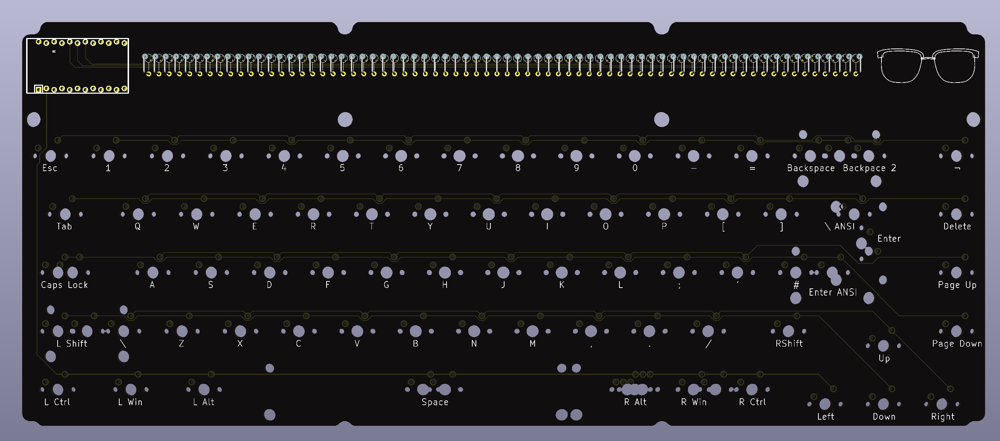

# KBIC65
65% keyboard PCB with ProMicro footprint. 

# Main features/focus
- Intended to be portable and wireless, but with a through-hole technology (THT) style
- 65%/70 key layout with spaced arrow keys and right-side navigation row in the style of Satistifaction75 and many others. 
- ProMicro footprint to allow upgrade of microcontroller, currently intended to be used with the nice!nano. Similar 
- Designed to be mountable in both an open PCB-stack or in a plate-mounted case
- 8x9 wiring matrix requiring only 17 pins on a ProMicro compatible controller

# Layout options

# Current State

# Comparison to similar keyboards

## Discipline65
The [Discipline65](https://github.com/coseyfannitutti/discipline) is the original inspiration for this keyboard, along with the case making community that has been born around it. In the spirit of CFTKB the board design will also be open source.

Some of the main differences
- KBIC65 will use a dedicated ProMicro footprint instead of all the THT components in the Discipline65, a believe this makes the board more easy to upgrade at the cost of losing some of the THT aesthethic.
- The layers in the Discipline FR4 kit have the same outer dimension (expluding the top part of the plate), which is nice for a pure FR4-style keyboard but creates some limitations if one wants to create a case for it. The KBIC65 will have a minimal PCB given the layout (on the left, bottom and right sides) and a plate with overhang allowing for various types of plate-mounted case designs.
- The PCB will have holes large enough to fit M2 spacers between THT row and the layout. This allows the FR4 kit-style assembly to have the PCB completely free-floating and only the switch plate connecting directly to the bottom plate.

## Nibble65
The [Nibble65](https://nullbits.co/nibble/) is another board inspired by the Discipline65. It has an additional column of keys on the left, allowing also for rotary encoders and the top of this column houses a ProMicro footprint. 

Some differences
- The Nibble65 has similar limitations to the Discipline65 in terms of case design compatibility
- The Nibble65 uses multiplexers (I believe) to keep the PCB wiring simple and to add a bit to the THT aesthethic. The KBIC65 uses an efficient wiring matrix allowing for a full 65%/70 key layout without additional components.
- The Nibble65 has an extra column to the left, housing a ProMicro-footprint, some extra keys as well as a multi-purpose section for either rotary encodes, giant LED or an OLED screen.

# FAQ

### Why don't you just buy keyboard X? It is cheaper and simpler than designing this.
I am doing this as a side project for fun, and the learning experience, and definitely not for profit.

If you want a 65% keyboard with the THT aesthetic get a Discipline65. If you want a 65% for your nice!nano, get the Nibble65. If you just want something wireless, get a Keychron.

### This is just a rip-off of keyboard X. What gives?
I am trying to make my own thing but the design is of course heavily inspired by other keyboards, especially THT kits. Some honorable mentions

- [Nicell Dissatisfaction65](https://github.com/Nicell/Dissatisfaction-65)
A very similar keyboard to what I am designing, by the creator of the nice!nano. This uses a lot of the "early" techniques for what I feel a wireless open-source firmware was in 2019-beginning of 2020 such as Adafruit Feather BLE with QMK, something that is much better done today with the nice!nano (and similar controllers) and the ZMK firmware.

- [CannonKeys Satisfaction75](https://ilumkb.com/blogs/news/satisfaction-75-r2)
My original inspiration for the layout

- [CFTKB Discipline65](https://github.com/coseyfannitutti/discipline)
Original inspiration for the THT design and the idea to make an FR4 kit first and a case after. The open-source Kicad files have also been a good sanity check, plus it has beautiful wiring!

- [Nullbits Nibble65](https://nullbits.co/nibble/)
A great take on the THT and would be my choice to buy if I didn't want to make something of my own but still make a nice!nano keyboard.

- [Lysol LCK75](https://p3dstore.com/products/lck75): No diode row but THT components otherwise and that arrow keys and navigation column stagger.

- [MujiManic Disarray65](https://sneakbox.com/products/disarray): Not exactly THT, but sooo much fun, beautiful wiring and one of the best case ideas ever. Case also comes in a version for the Discipline.

- [RMI-KB Herringbone75](https://rmi-kb.com/herringbone/): A fun variant on the Mysterium 75.

- [u/emdarcher Lattice 60%](https://keyhive.xyz/shop/lattice): Definintiely contender for most innovative diode placement among THT keyboards

- [theksmith Discipline65](https://theksmith.com/hardware/designing-building-custom-mechanical-keyboard-2020/): Honorable mention on Discipline65 case design

- [4Bar60 by u/struct_Nodes](https://www.reddit.com/r/MechanicalKeyboards/comments/kyjpx3/my_girlfriend_surprised_me_with_a_breakup_before/)
I found this keyboard in the middle of my PCB design but it is very similar to my intended design, expcept being a 60% of course.

- [WorldspawnsKeebs Houndstooth](https://www.etsy.com/uk/listing/717316405/houndstooth-kit-does-not-include?show_sold_out_detail=1&ref=nla_listing_details)
A split ortholinear 4x6 with a nice take on a clear case

- [Seoulcialite Argyle60](https://geekhack.org/index.php?topic=106255.0)
Great case for a THT kit and very interesting with side windows instead of placed above the key layout. Inspiration for moving the ProMicro footprint and diode row up 1/4 units to allow top case to have a divider between main layout and THT window.

- [EBastler Isometria75](https://github.com/ebastler/isometria-75)
Makes me want to try to change the keyspacing on my keyboard, but I am unfortunately not brave enough.