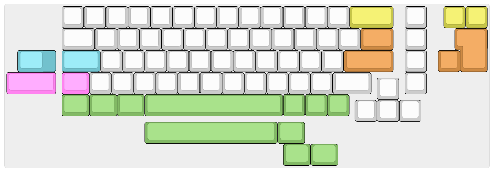
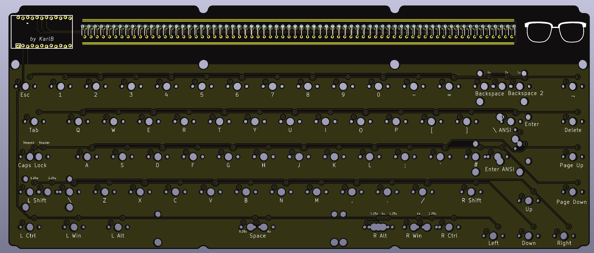
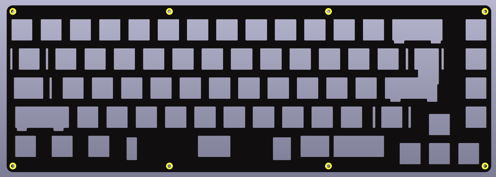
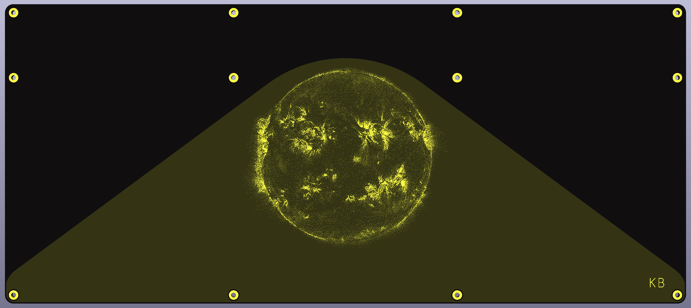
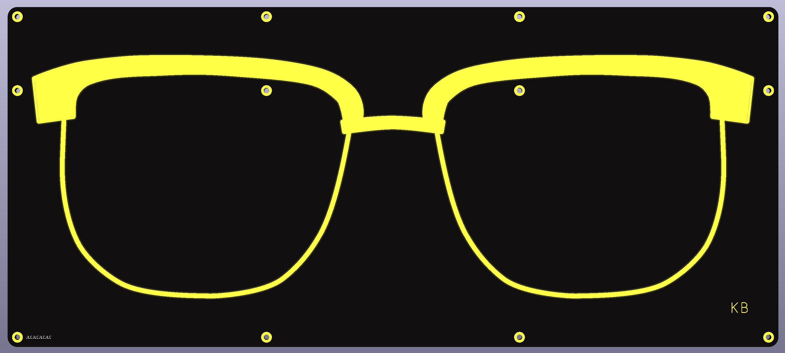

# KBIC65
A 65% [mechanical keyboard](https://keyboard.university/100-courses/intro-to-mechanical-keyboards) with a [ProMicro](https://deskthority.net/wiki/Arduino_Pro_Micro) controller footprint. Repository contains [KiCad](https://www.kicad.org/) PCB design files and 2D drawings in SVG of PCB, bottom plate, switch plate and acrylic window.

Bottom of keyboard has two alternatives. A design with glass rims inspired by my grandfather's glasses and a dithered image of the sun from the [NASA Solar Dynamics Observatory](https://svs.gsfc.nasa.gov/13641). Included below is also a [guide on creating dithered PCB art](#making-dithered-pcb-art-for-kicad).

[More photos](img/photoshoot/readme.md)

# Main features/focus
- Intended to be portable and wireless, but with a [through-hole technology (THT)](https://en.wikipedia.org/wiki/Through-hole_technology) style
- 65%/70 key layout with spaced arrow keys and right-side navigation row in the style of [Satistifaction75](https://cannonkeys.com/collections/group-buy/products/gb-satisfaction-75-keyboard-round-2) and many others
- ProMicro footprint to allow upgrade of the microcontroller, intended to be used with the [nice!nano](https://nicekeyboards.com/nice-nano/) and [ZMK](https://zmkfirmware.dev/) firmware for my personal build
- Designed to be mountable in both an open PCB stack or in a plate-mounted case (not yet designed)
- 8x9 wiring [duplex matrix](https://wiki.ai03.com/books/pcb-design/page/matrices-and-duplex-matrix) requiring only 17 pins on a ProMicro compatible controller

# Some design choices

- Reduced copper coverage on top of PCB and bottom plate, and no copper switch plate to improve Bluetooth signal
- Plate mounted with screws, the PCB contains drilled holes large enough to fit M2 spacers. I.e. the PCB is only connected to the plate via the switches.
- Tried to avoid vias, but have one (that I probably could have skipped)
- Since the bottom is symmetrical, there are two alternative design two choose from

# How to create your own
[See the v1.0 release](https://github.com/b-karl/KBIC65/releases/tag/v1.0.0) to find the files and list of parts to create your own. 
- Gerber zip-files are used to order the PCB, bottom plate and top plate from a PCB manufacturer, I used [JLCPCB](https://jlcpcb.com/). 
- The acrylic window can be ordered from any laser cutting firm working with acrylic, I live in Sweden and used [TechStation](https://techstation.se/en/). 
- For keycaps, switches and ProMicro-compatible controller (possibly also diodes) use a keyboard company in your region, I got my keycaps from [KBDfans](https://kbdfans.com/), diodes from a local electronics supplier and the rest from [Splitkb](https://splitkb.com/).
- Screws and stand-offs can be sourced from various places but are probably easiest to find on AliExpress.

I do not have dedicated assembly instructions, but if you are comfortable soldering you can probably make do using [my build log](build_log.md).
# Firmware
I decided to use [ZMK](https://zmkfirmware.dev/) for my build of this keyboard. Compared to the most common open source mechanical keyboard firmware [QMK](https://docs.qmk.fm/#/), ZMK is tailored for wireless keyboards. The two main reasons you should care to use ZMK instead of a bluetooth QMK fork are (1) much better power efficiency, i.e. longer battery life, and (2) the most commonly used Bluetooth chip uses drivers that are not compatible with the QMK copyleft license.

You can find my ZMK shield for the KBIC65 in [my ZMK config repository](https://github.com/b-karl/zmk-config).

If you want to use a non-wireless controller (like a ProMicro, Elite-C etc.), I have [created a QMK fork](https://github.com/b-karl/qmk_firmware/tree/add-kbic65-keyboard/keyboards/karlb/kbic65) that has been tested on the KBIC65 using an Elite-C rev 4.

# Layout options

# Components

## PCB Front

## Plate

## Bottom Option 1 (PCB Front)

## Bottom Option 2 (PCB Back)

# Making dithered PCB art for KiCad
When I decided to make an alternative design for the bottom I eventually settled on trying my hand at a dithered image. This was a little trickier than I expected to get looking like I wanted (and still not sure how the end result will appear).

But generally here is the workflow I used in the end, and would recommend
- Settle on an image to use, crop it to only the part you want to place on the PCB. I settled on a NASA SDO image.

- JLCPCB and probably other PCB manufacturers can print at a resolution of about 0.15 mm which is equivalent to about 169 DPI. This means you should try to use 169 DPI or less, I used 169 DPI. Resize your image so that the resolution of the image at your selected DPI gives you the size you want on the board. I wanted my sun to be approximately 90 mm high so I resized to 600px high, which results in an image 90.2 mm high at 169 DPI. 

- Use a dithering tool to dither your image and create a dithered copy. I strongly recommend [Ditherlicious](https://29a.ch/ditherlicious/) but you can look around for other tools you have handy.

- Open your KiCad project and then open Convert Image, a.k.a. the bitmap2component tool.
- Import your dithered image, select Negative if necessary, pick either Front Silk Screen or Front Solder Mask and enter your chosen DPI. Click export and put into a new folder that will become a new KiCad library for you.
- In Pcbnew or your KiCad project, open Preferences > Manage footprint libraries
- Add your new folder as a footprint library
- Import your new PCB art footprint onto your PCB

- Iterate, I played a lot with different dithering tools, changing the image histogram etc. The bitmap2component tool does not import dithered image exactly but blends pixels together, therefore I would recommend generating a few variants and comparing them in KiCad and possibly the 3D viewer. Please note that these images requires quite a bit of processing from KiCad. Updating the 3D view especially, which took about 1-2 min for me.

- Final result after ordering from JLCPCB with black solder mask and ENIG finish

# Comparison to similar keyboards

## Discipline65
The [Discipline65](https://github.com/coseyfannitutti/discipline) is the original inspiration for this keyboard, along with the case making community that has been born around it. In the spirit of CFTKB the board design will also be open source.

Some of the main differences
- KBIC65 will use a dedicated ProMicro footprint instead of all the THT components in the Discipline65, a believe this makes the board more easy to upgrade at the cost of losing some of the THT aesthetic.
- The layers in the Discipline FR4 kit have the same outer dimension (excluding the top part of the plate), which is nice for a pure FR4-style keyboard but creates some limitations if one wants to create a case for it. The KBIC65 will have a minimal PCB given the layout (on the left, bottom and right sides) and a plate with overhang allowing for various types of plate-mounted case designs.
- The PCB will have holes large enough to fit M2 spacers between THT row and the layout. This allows the FR4 kit-style assembly to have the PCB completely free-floating and only the switch plate connecting directly to the bottom plate.

## Nibble65
The [Nibble65](https://nullbits.co/nibble/) is another board inspired by the Discipline65. It has an additional column of keys on the left, allowing also for rotary encoders and the top of this column houses a ProMicro footprint. 

Some differences
- The Nibble65 has similar limitations to the Discipline65 in terms of case design compatibility
- The Nibble65 uses multiplexers (I believe) to keep the PCB wiring simple and to add a bit to the THT aesthetic. The KBIC65 uses an efficient wiring matrix allowing for a full 65%/70 key layout without additional components.
- The Nibble65 has an extra column to the left, housing a ProMicro-footprint, some extra keys as well as a multi-purpose section for either rotary encodes, giant LED or an OLED screen.

# Possible future work
- Non-metal case
- Solar cell trickle charging panel instead of window
- Remove unintended silk screen from front PCB glasses
- Add holes for mounting a battery connector
- Move JLCPCB production number location (or get it removed in production)
- Change battery to something slightly thinner, sub-5 mm, but could be wider and longer than the current battery

# FAQ

### What does KBIC mean?
The original name KBIC65 is inspired by soldering and tinkering in my grandfather's workshop as a child and have named it with our combined initials KB and IC. But having spent quite a bit of time on making PCB art for the bottom of the keyboard based on an image from the [NASA Solar Dynamics Observatory](https://svs.gsfc.nasa.gov/13641) I am considering renaming it if I make anything more of it (or make a group buy at some point). I am open to name suggestions if you have one!

### Why don't you just buy keyboard X? It is cheaper and simpler than designing this.
I am doing this as a side project for fun, and the learning experience, and definitely not for profit.

If you want a 65% keyboard with the THT aesthetic get a [Discipline65](https://github.com/coseyfannitutti/discipline). If you want a 65% for your nice!nano, get the [Nibble65](https://nullbits.co/nibble/). If you just want something wireless but don't want to build it yourself, get a [Keychron](https://www.keychron.com/).

### I really want to make one myself, can you please fix the remaining issues?
Maybe, if you have some experience or willingness to learn, fork this repo and try to fix it yourself (and maybe do a PR on the end result). If you don't have the experience or know-how, send me a message so I know someone actually wants it and I will consider fixing it when I have time.

### This is just a rip-off of keyboard X. What gives?
I am trying to make my own thing but the design is of course heavily inspired by other keyboards, especially THT kits. Some honorable mentions

- [Nicell Dissatisfaction65](https://github.com/Nicell/Dissatisfaction-65)
A very similar keyboard to what I am designing, by the creator of the nice!nano. This uses a lot of the "early" techniques for what I feel a wireless open-source firmware was in 2019-beginning of 2020 such as Adafruit Feather BLE with QMK, something that is much better done today with the nice!nano (and similar controllers) and the ZMK firmware. Nicell is the creator of the nice!nano and also very active in the ZMK project.

- [CannonKeys Satisfaction75](https://ilumkb.com/blogs/news/satisfaction-75-r2)
My original inspiration for the layout

- [CFTKB Discipline65](https://github.com/coseyfannitutti/discipline)
Original inspiration for the THT design and the idea to make an FR4 kit first and a case after. The open-source Kicad files have also been a good sanity check, plus it has beautiful wiring!

- [Nullbits Nibble65](https://nullbits.co/nibble/)
A great take on the THT and would be my choice to buy if I didn't want to make something of my own but still make a nice!nano keyboard.

- [Lysol LCK75](https://p3dstore.com/products/lck75): No diode row but THT components otherwise and that arrow keys and navigation column stagger.

- [MujiManic Disarray65](https://sneakbox.com/products/disarray): Not exactly THT, but sooo much fun, beautiful wiring and one of the best case ideas ever. Case also comes in a version for the Discipline.

- [RMI-KB Herringbone75](https://rmi-kb.com/herringbone/): A fun variant on the Mysterium 75.

- [u/emdarcher Lattice 60%](https://keyhive.xyz/shop/lattice): Definitely contender for most innovative diode placement among THT keyboards

- [theksmith Discipline65](https://theksmith.com/hardware/designing-building-custom-mechanical-keyboard-2020/): Honorable mention on Discipline65 case design

- [4Bar60 by u/struct_Nodes](https://www.reddit.com/r/MechanicalKeyboards/comments/kyjpx3/my_girlfriend_surprised_me_with_a_breakup_before/)
I found this keyboard in the middle of my PCB design but it is very similar to my intended design, except being a 60% of course.

- [WorldspawnsKeebs Houndstooth](https://www.etsy.com/uk/listing/717316405/houndstooth-kit-does-not-include?show_sold_out_detail=1&ref=nla_listing_details)
A split ortholinear 4x6 with a nice take on a clear case

- [Seoulcialite Argyle60](https://geekhack.org/index.php?topic=106255.0)
Great case for a THT kit and very interesting with side windows instead of placed above the key layout. Inspiration for moving the ProMicro footprint and diode row up 1/4 units to allow top case to have a divider between main layout and THT window.

- [EBastler Isometria75](https://github.com/ebastler/isometria-75)
Makes me want to try to change the key spacing on my keyboard, but I am unfortunately not brave enough.
